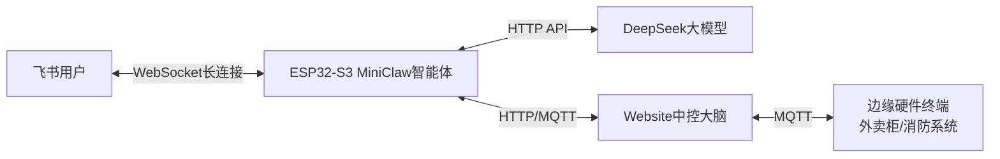

# ESP32-S3 MiniClaw 飞书智能体
**基于ESP32-S3的嵌入式轻量级AI智能体 | 飞书自然语言交互 | 深度适配AIoT智慧城市中控系统**

[](https://docs.espressif.com/projects/esp-idf/zh_CN/latest/esp32s3/)
[](https://open.feishu.cn/)
[](https://platform.deepseek.com/)
[](https://mqtt.org/)
[](LICENSE)

---

## 📋 项目简介
MiniClaw 是一款专为微控制器设计的**轻量级开源AI Agent框架**，可完整运行在仅几十元的ESP32-S3开发板上，无需Linux、无需树莓派、无需云服务器，即可实现「飞书自然语言交互-大模型意图解析-指令决策-硬件控制-结果回执」的全链路闭环。

本项目为MiniClaw的**飞书+DeepSeek定制化实现**，专为高校IoT毕业设计打造，可无缝接入智慧城市MQTT中控系统，作为系统的**自然语言交互入口与AI决策核心**。

### 核心能力
- ✅ 纯嵌入式运行：ESP32-S3单芯片即可跑完整ReAct代理循环
- ✅ 飞书原生交互：WebSocket长连接，内网可用，无需公网IP
- ✅ 国内友好：对接DeepSeek大模型，无需代理即可使用
- ✅ 超低功耗：整机运行功耗仅0.5W，支持7×24小时在线
- ✅ 高度可扩展：支持自定义技能、传感器接入、硬件控制
- ✅ 完美适配：无缝对接MQTT物联网中控系统，零侵入接入

---

## 🏗️ 系统架构
### 整体架构图


### 核心交互流程
1. 用户在飞书发送自然语言指令（如「打开外卖柜」）
2. 飞书通过WebSocket长连接将消息推送到ESP32-S3
3. MiniClaw将指令发送给DeepSeek大模型，完成意图解析与决策
4. 决策前通过HTTP拉取中控系统全局状态，做合法性校验
5. 校验通过后，通过HTTP/MQTT将标准指令发送给中控系统
6. 中控系统下发指令到硬件终端，执行完成后返回结果
7. MiniClaw将执行结果格式化后，通过飞书回复给用户

---

## 📦 前置准备
### 硬件要求
- 主控：ESP32-S3-WROOM-1开发板（推荐8MB PSRAM + 16MB Flash）
- 供电：USB-C 5V供电
- 网络：2.4GHz WiFi（不支持5GHz WiFi）

### 账号与密钥准备
1. **飞书开放平台**：企业自建应用的AppID、AppSecret
2. **DeepSeek开放平台**：API Key（需提前充值少量余额）
3. **Tavily搜索API**（可选）：联网搜索能力API Key

---

## 🚀 快速开始
### 1. 搭建ESP-IDF开发环境
1. 下载ESP-IDF v5.5+ 离线安装包：[官方下载地址](sslocal://flow/file_open?url=https%3A%2F%2Fdl.espressif.cn%2Fdl%2Fesp-idf%2F%3Fidf%3D4.4&flow_extra=eyJsaW5rX3R5cGUiOiJjb2RlX2ludGVycHJldGVyIn0=)
2. 打开安装包，选择完全安装，等待安装完成
3. 安装完成后，打开`ESP-IDF 5.5 CMD`命令行工具，验证环境正常

### 2. 获取项目源码
```bash
# 克隆MiniClaw官方源码
git clone https://github.com/memovai/mimiclaw.git
cd mimiclaw
```

### 3. 配置核心密钥
1. 进入`main`文件夹，复制`mimi_secrets.h.example`并重命名为`mimi_secrets.h`
2. 打开文件，填写核心配置信息：
```c
/* WiFi配置 */
#define MIMI_SECRET_WIFI_SSID "你的2.4G WiFi名称"
#define MIMI_SECRET_WIFI_PASS "你的WiFi密码"

/* 飞书机器人配置 */
#define MIMI_SECRET_FEISHU_APP_ID "你的飞书AppID"
#define MIMI_SECRET_FEISHU_APP_SECRET "你的飞书AppSecret"

/* 大模型配置 */
#define MIMI_SECRET_API_KEY "你的DeepSeek API Key"
#define MIMI_SECRET_MODEL "deepseek-chat"
#define MIMI_SECRET_MODEL_PROVIDER "openai"

/* 联网搜索配置（可选） */
#define MIMI_SECRET_TAVILY_KEY "你的Tavily API Key"
```
3. 打开`mimi_config.h`文件，修改大模型API地址：
```c
#define MIMI_OPENAI_API_URL "https://api.deepseek.com/chat/completions"
```

### 4. 编译与烧录
1. 在ESP-IDF命令行中，切换到项目根目录
2. 设置目标芯片：
```bash
idf.py set-target esp32s3
```
3. 清理缓存（可选，首次编译可跳过）：
```bash
idf.py fullclean
```
4. 编译项目：
```bash
idf.py build
```
5. 用USB线连接ESP32-S3与电脑，执行烧录：
```bash
idf.py flash monitor
```
6. 烧录完成后，串口将打印系统启动日志，看到`MimiClaw ready`即为启动成功

### 5. 飞书开放平台配置
1. 进入[飞书开放平台](sslocal://flow/file_open?url=https%3A%2F%2Fopen.feishu.cn%2Fapp&flow_extra=eyJsaW5rX3R5cGUiOiJjb2RlX2ludGVycHJldGVyIn0=)，打开之前创建的企业自建应用
2. 进入「事件与回调」页面，订阅方式选择**长连接（推荐）**
3. 添加事件：`接收消息v2.0 im.message.receive_v1`
4. 进入「版本管理与发布」，创建新版本并发布（个人版免审核）
5. 飞书客户端搜索应用名称，添加机器人，即可开始对话

---

## 🔌 与智慧城市AIoT中控系统对接指南
本项目完全适配你方的智慧城市MQTT中控系统，严格遵循「**所有硬件指令统一由中控收口**」的架构规则，彻底解决多入口竞态冲突问题。

### 对接方式1：HTTP接口对接（推荐，毕设首选）
#### 核心规则
MiniClaw仅与Website中控系统通信，不直接连接硬件，所有指令通过中控校验后下发。

#### 对接步骤
1. 在MiniClaw中创建自定义技能，配置中控系统HTTP接口：
   - 状态拉取接口：`GET http://[中控IP]:5000/api/status`
   - 指令提交接口：`POST http://[中控IP]:5000/api/send_cmd`
2. 配置大模型指令规则，限定仅支持预设指令集：
   | 飞书自然语言 | 中控标准指令 |
   |--------------|--------------|
   | 打开外卖柜 | UNLOCK |
   | 关闭外卖柜 | LOCK |
   | 触发火警 | EMERGENCY_FIRE |
   | 解除火警 | EMERGENCY_STOP |
   | 查询系统状态 | STATUS_REQ |
3. 配置决策前置校验：所有指令执行前，必须先拉取中控全局状态，应急状态下拒绝普通开锁指令

### 对接方式2：MQTT直连对接（可选）
#### 核心规则
仅开放应急指令直连权限，普通控制指令仍走中控，保障系统规则一致性。

#### 对接配置
1. 在`mimi_config.h`中开启MQTT客户端
2. 配置MQTT Broker地址：`broker.emqx.io:1883`
3. 配置发布主题：`city/openclaw/cmd`
4. 配置订阅主题：`city/openclaw/feedback`
5. 限定仅可发布应急指令，普通指令仍通过HTTP提交给中控

---

## 📟 CLI 命令参考
烧录完成后，可通过串口终端（波特率115200）使用以下命令配置系统，无需重新烧录固件：

| 命令 | 功能说明 |
|------|----------|
| `wifi_set SSID PASSWORD` | 修改WiFi名称与密码 |
| `wifi_status` | 查询WiFi连接状态与IP地址 |
| `set_api_key sk-xxxx` | 修改DeepSeek API Key |
| `set_model deepseek-chat` | 修改使用的大模型名称 |
| `config_show` | 查看当前所有配置信息 |
| `config_reset` | 恢复出厂默认配置 |
| `restart` | 重启系统 |
| `heap_info` | 查询芯片剩余内存 |
| `help` | 查看所有命令帮助 |

---

## ❓ 常见问题 FAQ
### 1. 烧录后WiFi连接失败怎么办？
- 确认WiFi为**2.4GHz频段**，ESP32-S3不支持5GHz WiFi
- 确认WiFi名称与密码无特殊字符，配置正确
- 确认WiFi无AP隔离、无MAC地址过滤

### 2. 飞书发送消息机器人无回复怎么办？
- 确认飞书应用已发布上线，机器人已添加到飞书
- 确认飞书事件订阅已开启长连接模式，添加了`接收消息v2.0`事件
- 确认`mimi_secrets.h`中的AppID与AppSecret配置正确
- 查看串口日志，确认飞书WebSocket连接成功

### 3. 大模型调用失败怎么办？
- 确认DeepSeek API Key配置正确，账户有可用余额
- 确认`mimi_config.h`中的API地址配置正确
- 确认ESP32-S3可正常访问外网，无网络拦截

### 4. 如何添加自定义硬件控制技能？
- 参考官方文档，在`/spiffs/skills/`目录下添加自定义技能文件
- 技能文件使用Markdown格式编写，定义硬件控制逻辑与指令格式
- 重启系统后，大模型即可自动调用自定义技能

---

## 📁 项目结构
```
mimiclaw/
├── main/                           # 项目核心源码
│   ├── mimi_secrets.h.example     # 密钥配置模板
│   ├── mimi_config.h               # 系统配置文件
│   └── 核心业务源码
├── components/                     # 组件依赖
├── spiffs_data/                    # 技能文件、资源文件
├── docs/                           # 官方文档
├── CMakeLists.txt                  # 项目编译配置
└── README.md                       # 项目说明
```

---

## 📄 许可证
本项目基于 [MIT 许可证](sslocal://flow/file_open?url=LICENSE&flow_extra=eyJsaW5rX3R5cGUiOiJjb2RlX2ludGVycHJldGVyIn0=) 开源，可自由使用、修改、分发，仅需保留原作者版权声明。

MiniClaw官方源码版权归 [memovai](sslocal://flow/file_open?url=https%3A%2F%2Fgithub.com%2Fmemovai&flow_extra=eyJsaW5rX3R5cGUiOiJjb2RlX2ludGVycHJldGVyIn0=) 所有，本项目为定制化适配实现。

---

## 🤝 贡献指南
欢迎提交Issue与PR优化项目：
1. Fork 本仓库
2. 创建功能分支 (`git checkout -b feature/AmazingFeature`)
3. 提交修改 (`git commit -m 'Add some AmazingFeature'`)
4. 推送到分支 (`git push origin feature/AmazingFeature`)
5. 提交 Pull Request
